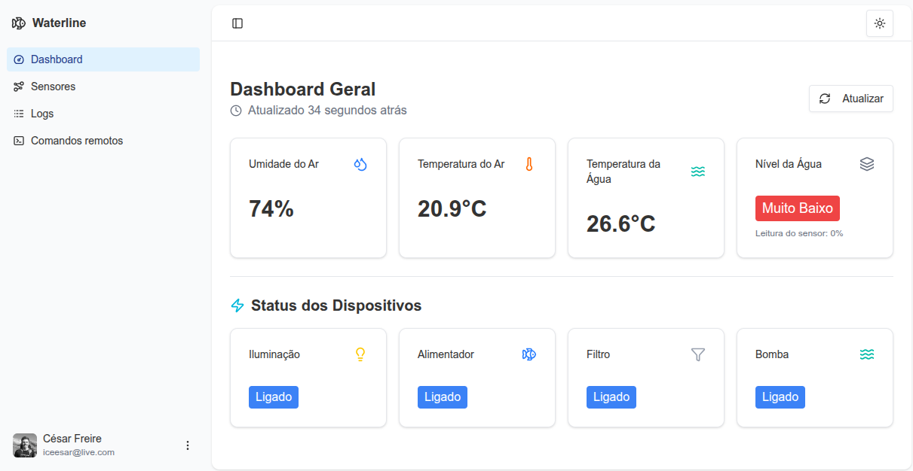
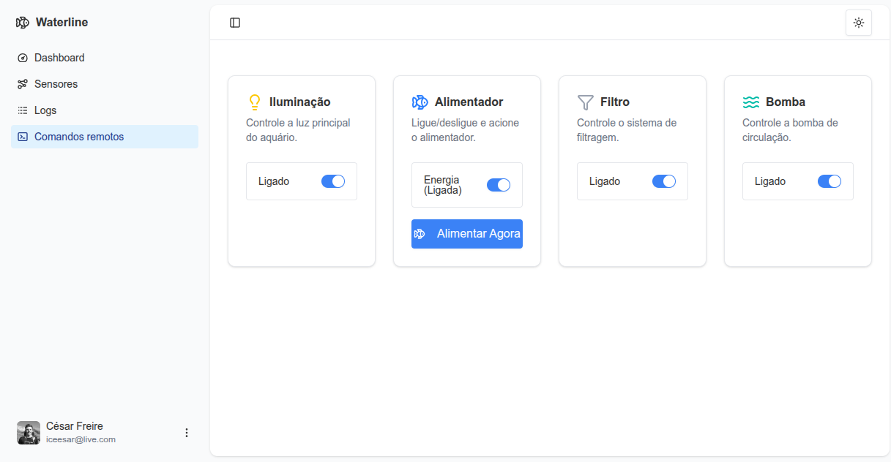
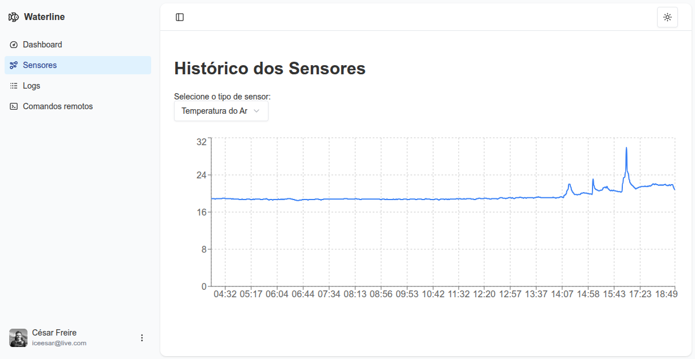
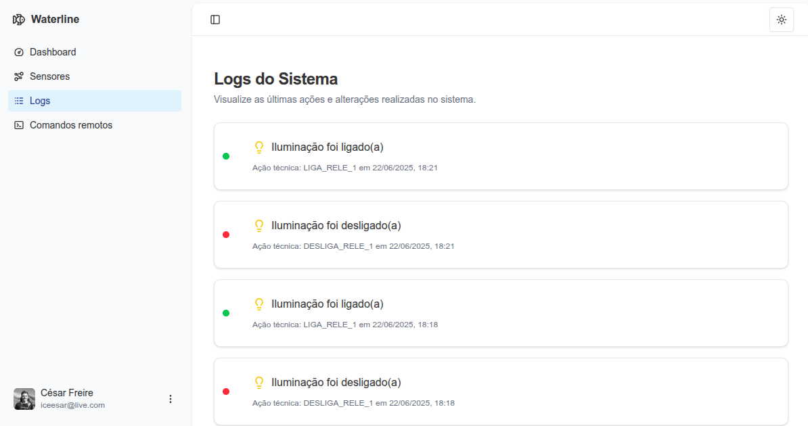

# Waterline - Frontend de Monitoramento e Controle


Interface web moderna e responsiva desenvolvida com Next.js e TypeScript para visualizar e controlar o sistema de automação de aquários Waterline IoT. A aplicação se conecta com um banco de dados MongoDB para coleta dos dados.

## ✨ Funcionalidades Principais

- **Dashboard em Tempo Real:** Visualização instantânea dos dados vitais do aquário, incluindo temperatura do ar e da água, umidade e status do nível da água (Normal, Baixo, etc.).
- **Controle Remoto de Dispositivos:** Interface dedicada para ligar e desligar individualmente os dispositivos conectados, como iluminação, bomba, filtro e acionar o alimentador.
- **Histórico de Sensores:** Gráficos de linha interativos que exibem os dados históricos de cada sensor, permitindo a análise de tendências.
- **Log de Atividades:** Um registro cronológico de todas as ações importantes executadas no sistema (dispositivos ligados/desligados, alimentador acionado), com mensagens e ícones amigáveis.
- **Autenticação de Usuários:** Sistema de login seguro utilizando NextAuth.js para proteger o acesso às páginas de controle.
- **Design Responsivo:** Interface adaptada para uma ótima experiência tanto em desktops quanto em dispositivos móveis.

## 🚀 Tecnologias Utilizadas

- **Framework:** [Next.js](https://nextjs.org/) (com App Router)
- **Linguagem:** [TypeScript](https://www.typescriptlang.org/)
- **Estilização:** [Tailwind CSS](https://tailwindcss.com/)
- **Componentes UI:** [shadcn/ui](https://ui.shadcn.com/)
- **Gráficos:** [Recharts](https://recharts.org/)
- **Autenticação:** [NextAuth.js](https://next-auth.js.org/)
- **Banco de Dados:** [MongoDB](https://www.mongodb.com/) (para logs e dados históricos)

## 📸 Telas do Projeto

| Dashboard Principal                | Controles Remotos                  |
| ---------------------------------- | ---------------------------------- |
|  |  |

| Histórico dos Sensores             | Logs de Atividade             |
| ---------------------------------- | ----------------------------- |
|  |  |

## ⚙️ Rodando o Projeto Localmente

Siga os passos abaixo para executar a aplicação no seu ambiente de desenvolvimento.

**1. Clone o repositório:**

```bash
git clone https://github.com/cesarfreire/waterline.git
cd waterline
```

**2. Instale as dependências:**

```bash
npm install
```

**3. Configure as Variáveis de Ambiente:**

Crie um arquivo chamado `.env.local` na raiz do projeto, copiando o conteúdo do arquivo `.env.sample` ou usando o modelo abaixo:

```bash
# Variáveis do Banco de Dados MongoDB
MONGODB_URI="sua_string_de_conexao_mongodb"
MONGODB_DATABASE="waterline"

# Variáveis da AWS IoT (para os comandos remotos)
AWS_IOT_ENDPOINT="seu-endpoint.iot.sua-regiao.amazonaws.com"
AWS_REGION="sua-regiao"
AWS_ACCESS_KEY_ID="sua_access_key"
AWS_SECRET_ACCESS_KEY="sua_secret_key"

# Variáveis do NextAuth.js
AUTH_SECRET="gere_uma_secret_aleatoria_aqui" # Pode usar `openssl rand -base64 32`
AUTH_GITHUB_ID="seu_github_client_id" # Exemplo se usar GitHub como provedor
AUTH_GITHUB_SECRET="seu_github_client_secret"
```

**4. Execute o servidor de desenvolvimento:**

```bash
npm run dev
```

**5. Abra o navegador:**

Acesse http://localhost:3000 para ver a aplicação funcionando.
